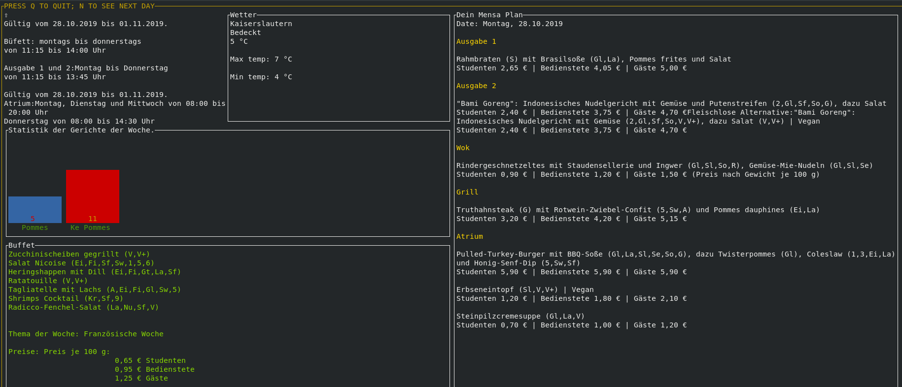

# Go-mensa-kl
> A terminal dashboard (and a crawler) for TUK Mensa's meal plan.



## Getting Started

The easiest way to use go-mensa-kl is to download its binary release (only Linux supported)

### Usage example
For retrieving the original meal plan, in German, run:
```
./go-mensa
```
or use the -lang argument with any language code supported by the Yandex translate api

```
./go-mensa -lang en # will translate the meal's text to English
```

### Using latest code

If you want to run the latest code, clone this repo and install all dependencies recursively with the go get command: go to the main directory of the project and  run:

```
  go get ./...
```  

to run the dashboard go to ui/ and run
```
  go run dashboard.go
```  

to run the dashboard go to ui/ and run
```
  go run dashboard.go
```  

## Built With

* [Colly](https://github.com/gocolly/colly) - Elegant Scraper and Crawler Framework for Golang
* [Termdash](https://github.com/mum4k/termdash) - Terminal based dashboard.

* [openweathermap](https://github.com/briandowns/openweathermap) - wrapper for the openweathermap.org's API
* [go-yandex-translate](https://github.com/dafanasev/go-yandex-translate) - wrapper for the Yandex Translate API
