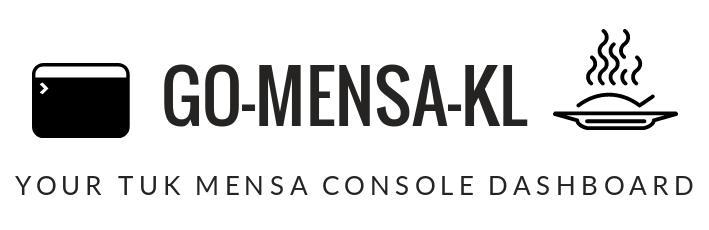

# Go-mensa-kl
> A terminal dashboard (and a crawler) for TUK Mensa's meal plan.



## About The Project


Go-Mensa-Kl gives you a single-view dashboard with:
 * a short summary of all meal plans in the Mensa and cafeteria (Atrium) of the University of Kaiserslautern
 * the opening times so you do not miss your lunch

 * a small weather widget with the current weather conditions in Kaiserslautern, helping you decide whether to grab a coat before you walk off to get some delicious Pommes :)

 * translated texts for the meals, which might be handy if you are not yet fluent in German (powered by Yandex)

 * Bar plot showing the number of meals in the week with and without fries (Pommes)
## Getting Started

The easiest way to use go-mensa-kl is to download its latest binary release [go-mensa](https://github.com/pfaaj/go-mensa-kl/releases) (only Linux supported)

### Usage example
For retrieving the original meal plan, in German, run:
```
./go-mensa
```
or use the -lang argument with any language code supported by the Yandex translate api

```
./go-mensa -lang en # will translate the meal's text to English
```

#### Using latest code

If you want to run the latest code, clone this repo and install all dependencies recursively with the go get command: go to the main directory of the project and  run:

```
  go get ./...
```  

to run the dashboard go to ui/ and run
```
  go run dashboard.go
```  

to build the dashboard go to ui/ and run
```
  go build dashboard.go
```  

## Built With

* [Colly](https://github.com/gocolly/colly) - Elegant Scraper and Crawler Framework for Golang
* [Termdash](https://github.com/mum4k/termdash) - Terminal based dashboard.

* [openweathermap](https://github.com/briandowns/openweathermap) - wrapper for the openweathermap.org's API
* [go-yandex-translate](https://github.com/dafanasev/go-yandex-translate) - wrapper for the Yandex Translate API
